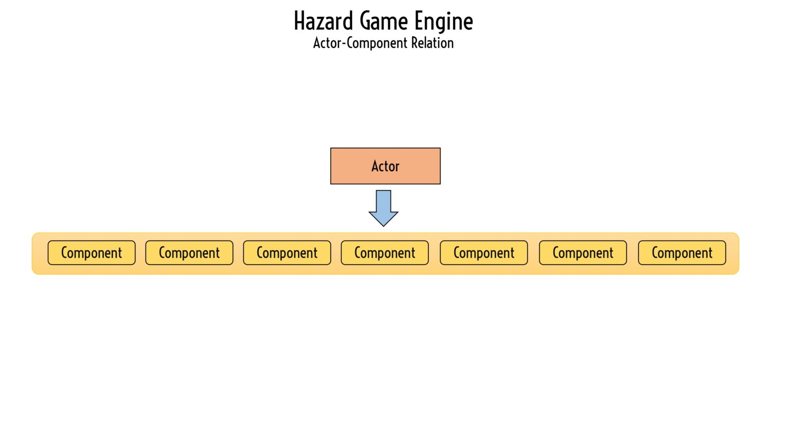
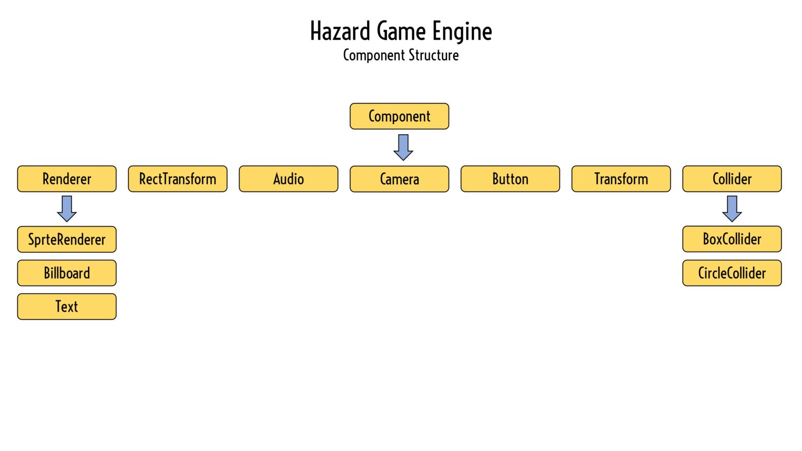

*Game Programmer and Tool Developer*

### Getting Started

| Requirements | Installation | Installation | Projects |
| - GNU Compiler at least 17 version.<br> - Visual Studio Code is recommended. | - Download the engine source code from [itch.io](https://abhijit-biswas.itch.io/hazard-game-engine) or [github](https://github.com/gamdevAbhi/Hazard-Game-Engine.git).<br> - Extract the file to your location. | - Make sure to change the compiler path in “.vscode/tasks.json“ (if using vs code). | Cosmic Mayhem - [Source Code](https://github.com/gamdevAbhi/Cosmic-Mayhem) (Github)|

## Core Classes

### GameLoop

```cpp
void Engine::GameLoop::initialize(std::string title)
```
**title** - it’s the game window title.  
It’s called before calling any engine features. It initialize the engine and it’s necessary components like collider manager, rendering manager, window, inputs etc.

```cpp
void Engine::GameLoop::begin()
```
It’s start the games loop.

```cpp
void Engine::GameLoop::endGameLoop()
```
It makes the games loop to break. Uses for exiting the application.

```cpp
glm::ivec2 Engine::GameLoop::getCurrentWindowSize()
```
**returns** - the window size.  
x = window width  
y = window height  
It returns the current window size of the application.  

### Input

```cpp
enum KeyStatus {KEY_NONE, KEY_PRESS, KEY_HOLD, KEY_RELEASE}
```
**KEY_NONE** - if the specific key has no pressing event then this return.  
**KEY_PRESS** - if the specific key is pressed then this return.  
**KEY_HOLD** - if the specific key is hold then this return.  
**KEY_RELEASE** - if the specific key is release then this return.  

```cpp
Engine::Input::KeyStatus Engine::Input::getKeyStatus(int key)
// key value is the relative to glfw keys eg. GLFW_KEY_A value is for A key.
```
**returns** - the current status of the key in that frame.

```cpp
Engine::Input::KeyStatus Engine::Input::getMouseButtonStatus(int mouseButton)
// mouseButton value is the relative to glfw mouse buttons.
// eg. GLFW_MOUSE_BUTTON_0 value is for left mouse button key.
```
**returns** - the current status of the mouse button in that frame.

```cpp
glm::vec2 Engine::Input::getMousePos()
```
**returns** - the current position of the mouse in that frame.

### Time

```cpp
float Engine::Time::getTimeScale()
```
**returns** - the current time scale value.

```cpp
void Engine::Time::setTimeScale(float timeScale)
```
**timeScale** - set the time scale value.

```cpp
float Engine::Time::getDeltaTime()
```
**returns** - the current delta time. Delta time is the time difference between two frames in seconds. It’s value depends on time scale.

```cpp
float Engine::Time::getFixedDeltaTime()
```
**returns** - the current unscaled delta time.

```cpp
int Engine::Time::getLastFPS()
```
**returns** - the previous frame per second.

### UI

```cpp
glm::vec2 Engine::UI::getResolution()
```
**returns** - the current UI resolution size.

```cpp
void Engine::UI::setResolution(glm::vec2 size)
```
**size** - set the current UI resolution. default value is the window size.

## Management Classes

### RendererManager

```cpp
int Engine::RendererManager::getLastRendererCount()
```
**returns** - the last total number of renderer needed to drawn.

### ColliderManager

```cpp
int Engine::ColliderManager::getTag(std::string tagName)
```
**returns** - the tag value of the tag.

```cpp
int Engine::ColliderManager::addTag(std::string tagName, bool selfRelation)
```
**returns** - the tag value of the added tag.  
this function create a tag based on the tag name and assign a value. if **selfRelation** is true then two collider with same tag will interact.  

```cpp
void Engine::ColliderManager::addRelation(int tag1, int tag2)
```
this function create a relation between two tags. if relation between two tags exist then colliders with tags will interact.

## Actor and Component Classes




### Actor

```cpp
Engine::Actor* Engine::Actor::createActor(std::string name)
```
**returns** - a pointer to a new actor with the name.  
It creates a new actor with the name. Every actor will have Transform component if creates in this way.
```cpp
Engine::Actor* Engine::Actor::createUIActor(std::string name)
```
**returns** - a pointer to a new UI actor with the name.  
It creates a new UI actor with the name. Every actor will have RectTransform component if creates in this way.
```cpp
Engine::Actor* Engine::Actor::getActor(std::string name)
```
**returns** - a pointer to the actor with the name.  
It finds actor with the name and return it. If no actor found with that name it will return nullptr.

```
std::vector<Engine::Actor*> Engine::Actor::getActors(std::string name)
```
**returns** - a vector of pointers of the actors with the name.  
It finds all the actors with the name and return it.

```
int Engine::Actor::getActorCount()
```
**returns** - the number of actors exist in the game.

```
void Engine::Actor::clearActors()
```
It destroy all the actors which manualDestroy set to false before the next frame.

```
std::string this->getName()
```
**returns** - the actor’s name.

```
void this->setName(std::string name)
```
set the actor’s name.

```
bool this->getActive()
```
**returns** - the actor’s active status.

```
void this->setActive(bool status)
```
**status** - set the actor’s active status.  
**Note** - if actor’s active set to false then the **update()**, **lateUpdate()**, **fixedUpdate()** will not be called and other things like collision detection, rendering will also be ignored.

```
bool this->getManualDestroyStatus()
```
**returns** - the actor’s manual destroy status.

```
void this->setManualDestroyStatus(bool status)
```
**status** - set the actor’s manual destroy status.  
**Note** - if actor’s manual destroy status set to true then the actor will only be destroyed by **setDestroy()** call or after game loop is break.

```
void this->setDestroy(bool childIncluded)
```
the actor will be destroyed before the next frame start.  
**Note** - if the **childIncluded** is false then only the actor will be destroyed and it’s child’s parent will nullptr else all childs also be be destroyed.

```
// T must be derived from Engine::Component class
T* this->addComponent<T>() 
```
**returns** - a pointer of the created component.  
It creates the component and attach it to the actor. After adding the component **Start()** function is called.

```
// T must be derived from Engine::Component class
T* this->getComponent<T>()
```
**returns** - a pointer of the added component from the actor.  
It finds the component added to the actor. if no component is found then nullptr is returned.

```
// T must be derived from Engine::Component class
std::vector<T*> this->getComponents<T>() 
```
**returns** - a vector of pointers of the added components from the actor.  
It finds the components added to the actor.

### Component

### Collider

### Renderer

## Resource Classes

### Sprite

**Sprite** - sprites are the images which are shown the game. The Sprite class constructor take relative path of the desired image.

```cpp
Sprite(std::string relative_path) // Constructor
```

```cpp
void this->destroy()
```
this functions destroy the sprite and free the memory. Make sure to remove the sprite from all renderers which are using it.

### Font

**Font** -  fonts are used for rendering text in the game. The Font class constructor take relative path of the desired font. Font must be in **Truetype format (.ttf)**.

```cpp
Font(std::string relative_path) // Constructor
```

```cpp
void this->destroy()
```
this functions destroy the font and free the memory. Make sure to remove the font from all text renderers which are using it.

## Component Classes

### Audio

### Button

### Camera

### Transform

### RectTransform

## Renderer Classes

### SpriteRenderer

### BillboardRenderer

### Text

## Collider Classes

### BoxCollider

```cpp
void this->setBoundary(float left, float right, float up, float down)
```
set the area of the **BoxCollider**.

```cpp
glm::vec2 this->getWidth()
```
**returns** - get the BoxCollider width.
```cpp
glm::vec2 this->getHeight()
```
**returns** - get the BoxCollider height.

### CircleCollider

```cpp
float this->getRadius()
```
**returns** - get the radius of the **CircleCollider**.
```cpp
void this->setRadius(float radius)
```
set the radius of the **CircleCollider**.