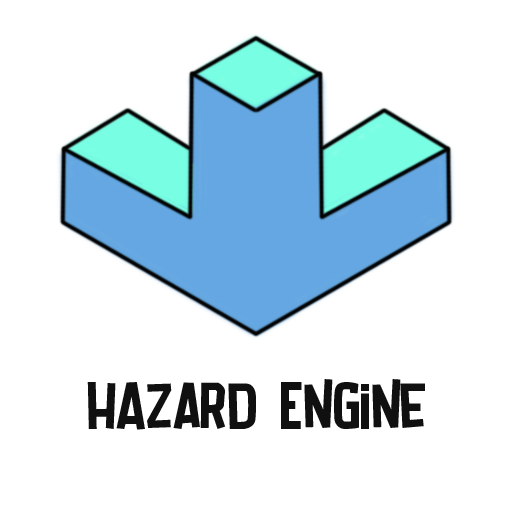

*Game Programmer and Tool Developer*

## Hazard Game Engine

#### About:
Hazard Game Engine, created in C++, draws inspiration from Unity Engine seamlessly incorporating familiar syntaxes for enhanced user navigation. Designed as my passion project, it serves as a professional showcase of skills, offering a dynamic 2D game development environment.

#### Features:
– **Unity Like Syntax**: Has similar syntax and features compare to Unity game engine.  
– **Collision Detection**: In-built dynamic collision detection with different shapes and has optimization features like collider tags.  
– **UI and Font Support**: In-built UI components like Button, Billboard (for images), Text Renderer etc.  
– **Audio Support**: In-built audio support (.mp3, .wav etc.)  
– **Mouse and Keyboard Support**: In-built detailed input system for keyboard and mouse (press, hold, release, etc.)  
– **Open-Source**: Anyone can modify, expand and use for their cases without any issues.  

**Technology Used**: C++, OpenGL, FreeType, GLM.