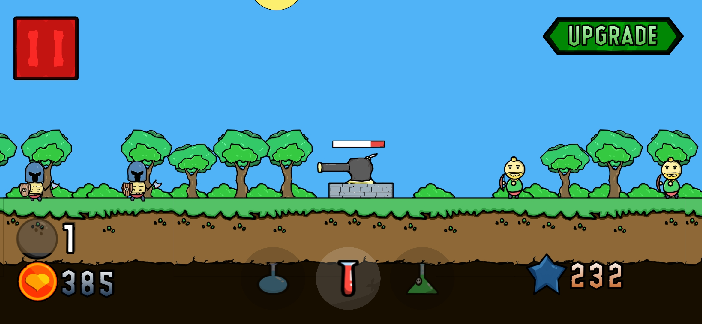

*Game Programmer and Tool Developer*

## Hazard Game Engine

**[Demo Gameplay Footage (Youtube)](https://youtu.be/IIWMY1Wx3PQ)**

#### About:
Hazard Game Engine, created in C++, draws inspiration from Unity Engine seamlessly incorporating familiar syntaxes for enhanced user navigation. Designed as my passion project, it serves as a professional showcase of skills, offering a dynamic 2D game development environment.

#### Features:
– **Unity Like Syntax**: Has similar syntax and features compare to Unity game engine.  
– **Collision Detection**: In-built dynamic collision detection with different shapes and has optimization features like collider tags.  
– **UI and Font Support**: In-built UI components like Button, Billboard (for images), Text Renderer etc.  
– **Audio Support**: In-built audio support (.mp3, .wav etc.)  
– **Mouse and Keyboard Support**: In-built detailed input system for keyboard and mouse (press, hold, release, etc.)  
– **Open-Source**: Anyone can modify, expand and use for their cases without any issues.  

**Technology Used**: C++, OpenGL, FreeType, GLM.

#### Link:
- **Source Code**:  [github](https://github.com/gamdevAbhi/Hazard-Game-Engine.git)
- **Download**: [itch.io](https://abhijit-biswas.itch.io/hazard-game-engine)
- **Tech Demo Game Source Code**: [github](https://github.com/gamdevAbhi/Cosmic-Mayhem.git)
- **Tech Demo Game Download**: [itch.io](https://abhijit-biswas.itch.io/cosmic-mayhem)

## Isometric Biome Generator

#### About:
I’m thrilled to share a recent project I’ve been working on—an isometric procedurally generated 2D biome system in Unity Engine. This tool allows you to create a diverse range of biomes including forests, deserts, snowy regions, seas, islands, rivers, mountains, and so much more, all with a few tweaks to the parameters. Enhanced with noise smoothing techniques to produce more natural and visually appealing results. By adjusting parameters, you can sculpt unique landscapes, each with its own distinct features and characteristics.

#### Features:
- **Diverse Biome**: From lush forests to arid deserts, snowy terrains to serene seas, the system generates various biomes seamlessly.  
- **Noise-Smoothing**: Fine-tune the biome generation with adjustable parameters for endless creative possibilities.  
- **Modified Wave Function Collapse**: My custom WFC implementation, coupled with noise smoothing, ensures that the generated biomes are both varied and coherent.  

**Technology Used**: C#, Unity Game Engine, Photoshop.

#### Link:
- **Source Code**: [github](https://github.com/gamdevAbhi/Isometric-Biome-Generator)
- **Download**: [github](https://github.com/gamdevAbhi/Isometric-Biome-Generator/releases)

## Ghost Sniper

**[Gameplay Footage (Youtube)](https://youtu.be/G75rH3-bBBM)**

#### About:
It is a 2D shooter game that offers endless session where player will fight against terrorists and save the city. Player can level up by scoring higher scores. The game has various difficulty and players can buy, upgrade their weapons. The game has also various power ups and can be obtained from killing terrorists.

#### Link: 
- **Download**: [itch.io](https://abhijit-biswas.itch.io/ghost-sniper)

## Cannon Fist

#### About:
It is 2D defence game with scoring system. The game has many different types of enemy with different type of powers. It has a upgrading system for the cannon and spells. It also has day night cycle.

#### Link:
- **Download**: [itch.io](https://abhijit-biswas.itch.io/cannon-fist)